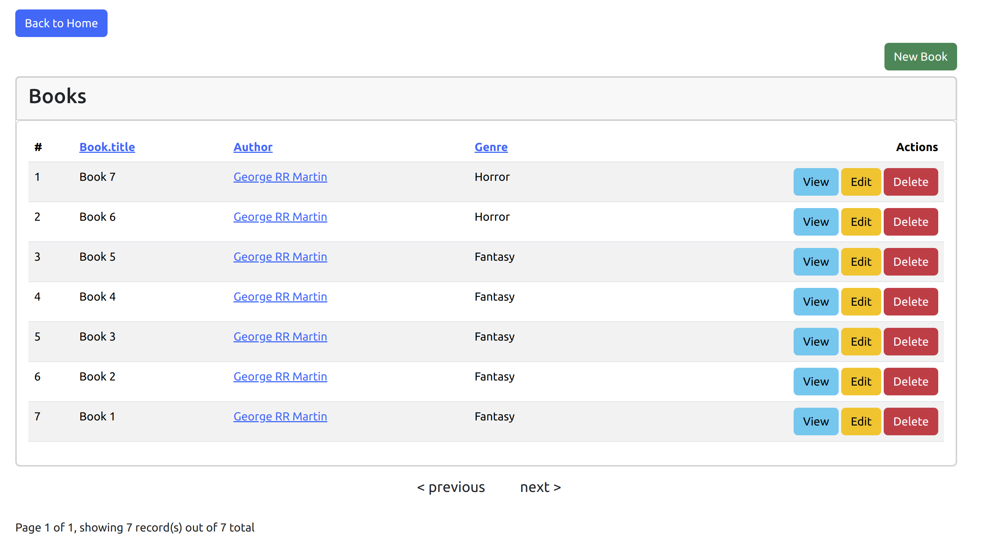

## Books management application Test
Requirements:

- Develop a CRUD (Create, Read, Update, Delete) functionality for managing 'Books' using the provided database tables.
- Create a dedicated report page that displays the number of books under each author and genre.
- As a bonus, consider adding a column to display the percentage of each genre in relation to the total number of books.
- Develop the necessary SQL queries without utilizing a query builder.
- Make sure that the pages look nice.
- You may choose between using CakePHP or core PHP for this task.

## Steps of Installation
``` bash
git clone https://github.com/AmsaluGit/books.git
```
``` bash
- cd books
```
- Update config/app_local.php datasource according to your database credentials.
``` bash
composer install
```
- create database 'books' in your machine.

- open terminal and run the followings commands:
``` bash
bin/cake migrations migrate
```
``` bash
vendor/bin/phinx seed:run
```
``` bash
bin/cake server
```


- open the link generated on your terminal with browser.
